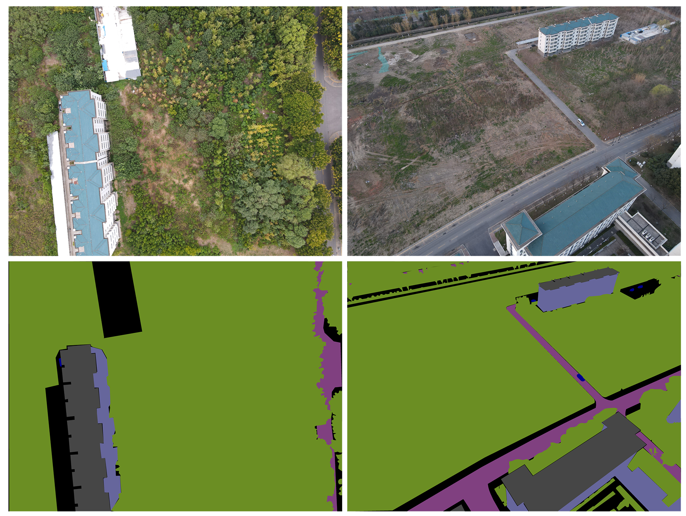
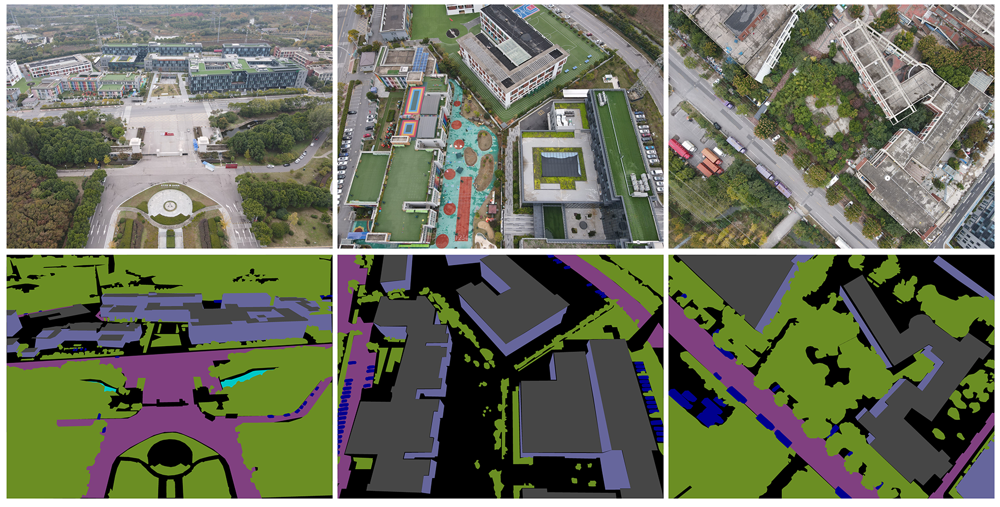
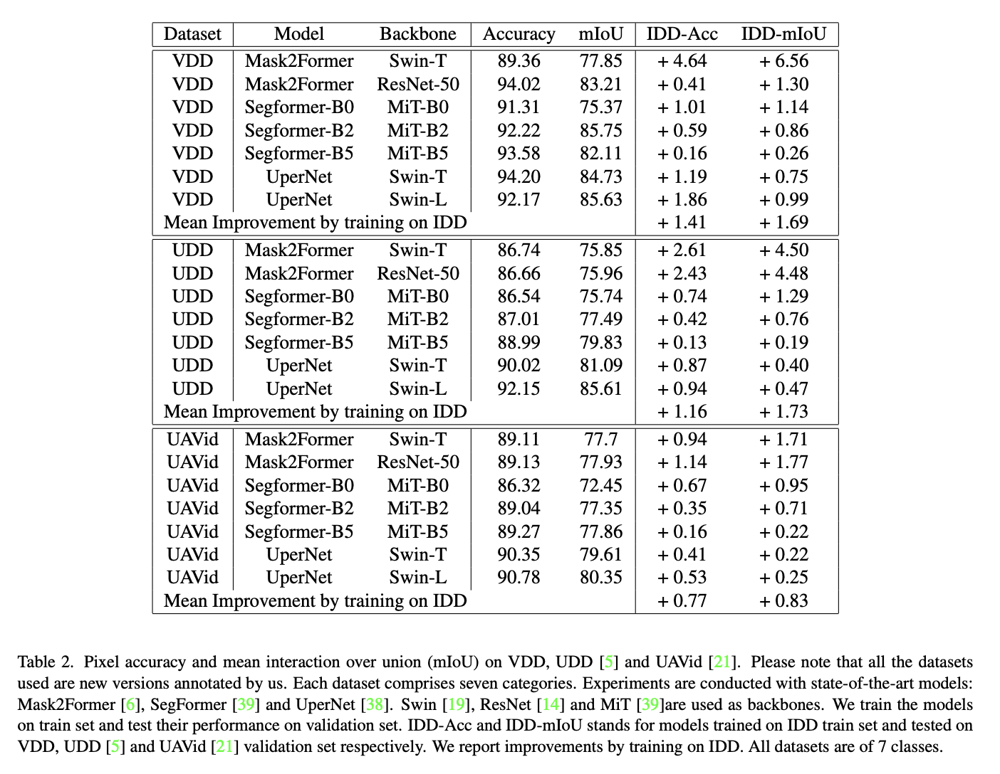

# VDD: Varied Drone Dataset for Semantic Segmentation

<p align="center">
    <a href="https://arxiv.org/abs/2305.13608">
        
    </a>
    <a href="https://huggingface.co/datasets/RussRobin/VDD">
        
    </a>
    <a href="https://github.com/RussRobin/VDD/blob/main/VDD_TermsOfUse.pdf">
        
    </a>
</p>

This is the official repo for VDD: Varied Drone Dataset for Semantic Segmentation. [[arXiv](https://arxiv.org/abs/2305.13608)].
(Journal of Visual Communication and Image Representation, 2025)


[Wenxiao Cai](https://russrobin.github.io/), [Ke Jin](https://scholar.google.com/citations?user=kT99gQQAAAAJ&hl=en), [Jinyan Hou](https://scholar.google.ca/citations?user=B955zDcAAAAJ&hl=en&oi=ao),
[Cong Guo](https://scholar.google.ca/citations?hl=en&user=-W1AdmoAAAAJ), [Letian Wu](https://scholar.google.ca/citations?user=HKwCsCkAAAAJ&hl=en&oi=ao), [Wankou Yang](https://automation.seu.edu.cn/ywk/list.htm)

## Download Links
This Dataset is only for non-commercial use. 

You will be automatically granted access to VDD on [Hugging Face](https://huggingface.co/datasets/RussRobin/VDD).

To access our new annotation to UDD & UAVid,
please fill out the [Terms of Use](https://github.com/RussRobin/VDD/blob/main/VDD_TermsOfUse.pdf) 
and send it to: `wxcai@stanford.edu`

**MMSegmentation configs**
- [Google Drive](https://drive.google.com/drive/folders/1799udtcNwbCHejy42MEx7L_JqRVvB9Hk?usp=share_link)
We provide config files based on MMSegmentation. Please first go to https://github.com/open-mmlab/mmsegmentation and download source codes for MMSegmentation. You may then add our uploaded files to corresponding paths in MMSegmentation.

**Papers With Code**

You may submit your semantic segmentation results on Papers with Code.

Varied Drone Dataset(VDD): https://paperswithcode.com/paper/vdd-varied-drone-dataset-for-semantic

Integrated Drone Dataset(IDD): https://paperswithcode.com/dataset/integrated-drone-dataset-for-semantic


## Introduction
VDD is a dataset featuring varied scenes, camera angles and weather/light conditions of UAV images. We provide 400 pixel-level annotated images with high resolution. Images are categorized into 7 classes: Wall, Roof, Road, Water, Vehicle, Vegetation and Others. We fouc on variance in this dataset. 

**Scene variance**
Many typical scenes are included in VDD dataset: 
* Municipal residential zones, villas, school and college buildings, and hospitals
* Highways and roads, 
* Facilities like gyms cantenn and libraries
* Natural scenes: rivers, lakes and mountains
* Rural areas: villages and farm fields


**Time & Light condition variance**
The example images are taken in spring and summer, where light conditions and vegetation changes. There is also a set of photos of the same object but taken at morning and evening respectively.



**Camera angle variance**
Photos are taken with fixed camera angles: 30, 60 and 90(bird view) degrees.



## Benchmarks


## Class id
| VDD class id | VDD class   | UDD original class        | UAVid original class                |
|--------------|-------------|---------------------------|-------------------------------------|
| 0            | other       | other                     | background clutter                  |
| 1            | wall        | wall                      | building (roof not included)        |
| 2            | road        | road                      | road                                |
| 3            | vegetation  | vegetation                | tree, low vegetation                |
| 4            | vehicle     | vehicle                   | moving car, static car              |
| 5            | roof        | roof                      | **our new annotation**              |
| 6            | water       | **our new annotation**    | **our new annotation**              |


## Usage
Please feel free to start an issue if you have questions about VDD.

**Citation**
```
@article{cai2023vdd,
  title={VDD: Varied Drone Dataset for Semantic Segmentation},
  author={Cai, Wenxiao and Jin, Ke and Hou, Jinyan and Guo, Cong and Wu, Letian and Yang, Wankou},
  journal={arXiv preprint arXiv:2305.13608},
  year={2023}
}
```

**Terms of use**

VDD: Varied Drone Dataset is made freely available to academic and non-academic entities for non-commercial purposes such as academic research, teaching, scientific publications, or personal experimentation. Permission is granted to use the data given that you agree:

That the dataset comes “AS IS”, without express or implied warranty. Although every effort has been made to ensure accuracy, we (Southeast University) do not accept any responsibility for errors or omissions.
That you include a reference to the Semantic Drone Dataset in any work that makes use of the dataset. For research papers or other media, refer to our paper.

That you do not distribute this dataset or modified versions. It is permissible to distribute derivative works in as far as they are abstract representations of this dataset (such as models trained on it or additional annotations that do not directly include any of our data) and do not allow to recover the dataset or something similar in character.

That you may not use the dataset or any derivative work for commercial purposes as, for example, licensing or selling the data, or using the data with a purpose to procure a commercial gain.

That all rights not expressly granted to you are reserved by us (Southeast University).
